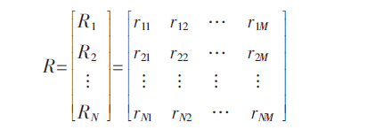

# 1. 一种改进的协同过滤推荐算法

## 1.1. 引言部分

网络购物的人群和网络商品的增多，使得人想要找到自己想要的产品需要花费越来越多的时间，推荐系统应运而生，可以大大减少检索时间。在本质上，推荐系统分为基于内容的推荐系统和基于协同过滤的推荐系统，近年来混合推荐系统的趋势也在不断增长。

基于内容的推荐系统需要根据产品的类别以及其它属性等向用户推荐产品。一般来说基于内容的推荐系统需要商品和用户的详细信息，它可以向用户推荐新商品，但是 **它需求的信息是巨大的，而且很难获取所有用户和商品的属性以及其它信息** ,此外收集代表用户或商品的唯一属性也很难。

协同过滤推荐系统不需要用户或商品属性的详细信息，它通过用户和商品之间的交互信息向用户推荐商品，通常的交互信息表示为用户对商品的评分，也即评分矩阵。实现起来相对更加高效和容易。

然而网络商店中通常有相当多的产品，如何在推荐前要对每一个商品进行考虑，推荐系统将是非常低效的。降维技术已在面对大规模数据产生快速、高效推荐系统中得到了广泛的应用。比如K-means的一种变形 **B-Kmeans** 算法来对用户进行不同的划分（可根据用户性别、年龄、职业等属性进行划分）。还可以用 **模糊聚类** 方法运用到用户上对用户进行聚类，利用用户组特征向量代表用户，对用户代表的维度降维。ICCRS算法是一种迭代评分算法，它对有偏见的评价者有很大的鲁棒性。上述基于维度降低的推荐系统具有一些缺点。一些系统需要关于用户或商品的额外属性来对用户或者商品进行聚类，而这些属性通常是很难在实际应用中得到的；另一些系统需要预先给出聚类的数量，这对用户来说是很难确定的，只能通过重复训练，这是个很大的负担。此外，使用降维的推荐系统在计算相似性的时候仅仅考虑聚类的中心，忽略聚类的方差可能导致推荐结果的不精确。

本文提出一种改进的ItemRank方法， 应用 **自构建聚类** 算法来减少商品的维度，创建出商品聚类之间的相互关系的相关图，然后执行一些列的随机游动，为每个用户生成商品聚类的推荐列表。最后执行将商品聚类推荐列表转换成单个商品的推荐列表。不需要搜集用户和商品的额外属性信息，不需要要用户提供预定的聚类数量。此外，在计算相似性的时候我们不仅考虑聚类中心，还应用聚类方差等因素。由于商品数量维度的减少，推荐算法的执行时间也大大减少。

## 1.2. 相关算法

### 1.2.1. 一般的ItemRank 算法
用户项目评分矩阵，每一项 $r_{i,j}$ 表示用户 $u_i$ 对商品 $p_j$ 的评分。

R的每一列代表一个商品，每一行代表一个用户，这里有N个用户和M个商品，协同过滤推荐系统的目标是给定用户项目评分矩阵，预测用户对商品的喜好程度，向用户推荐商品 。

ItemRank算法，是协同过滤的基本方法之一。它应用于基于图模型的推荐算法，通过项目节点来构成图，形成项目间的关联关系图并计算得到用户的项目偏好向量，然后利用 **随机游走算法** 预测用户对项目的预测评分，最后向用户推荐生成的Top-k商品。在关联关系图中，每一个节点都是一个商品，商品 $p_i$ 和 商品 $p_j$ 之间的连线 $w_{i,j}$ 为同时购买 这两个商品的数量。

这是一个MxM的矩阵，要对每一列进行归一化。在随机游走算法中，假设用户 $u_i$ 对应的 $S_i=[1/M,1/M,...,1/M]^T$ (M维向量) ，通过公式

$$S_i(t+1)=\alpha W S_i(t)+ (1-\alpha) R_i^T$$

进行迭代直到收敛，  $\alpha$ 是个给定的参数，通常取0.85，迭代20次达到收敛效果。根据最终得到的 $S_i$ 各项值的大小向用户 $u_i$ 推荐相应的商品。

### 1.2.2. 改进的算法

一般的ItemRank算法在求矩阵W的时候非常耗时，因为商品的数量非常之多。然后在计算 $S_i$ 的迭代时，也会随着用户数量的增多而增多。因此算法的复杂度比较高。在改进的算法中，采用 **自构建聚类SCC** 算法进行降维。首先对用户分配类标签，然后对商品进行聚类，再构建商品关联图，然后通过随机游走算法得出商品类 对 用户 $u_i$ 的推荐，最后进行转换，将商品类的推荐转换到商品个体的推荐。

#### 1.2.2.1. 核心算法--自构建聚类算法

假设模式X有n个模式(X是一个矩阵，每个模式可以理解为一行或者一列)，每个模式都是一个p维的向量，SCC算法就是将这些模式分配到不同的聚类中。假设现存K个聚类，分别式 $G_1,G_2,...G_k$  ,每一个聚类 $G_j$ （p维向量） 的平均值为 $m_j$ （ $m_j$也同样是一个p维向量） ，标准差为 $\sigma_j$ . $s_j$ 表示 $G_j$ 的大小，它表示 $G_j$ 里面包含的模式的个数。初始化时K=0，计算每个模式 $X_i$ 对 $G_j$的隶属度： $\mu_{G_j}(X_i)$

$$
\mu_{G_j}(X_i)= \prod_{q=1}^p e^{-(\frac{x_{iq}-m_{jq}}{\sigma_{jq}})^2}
$$

如果隶属度 $\mu_{G_j}(X_i)$  不小于给定的阈值 $\rho$ ,就通过了检测，最后对于每个 $X_i$ 有两种情况： 1. 它没有通过任何一个检测，那么此时就创建一个聚类 $G_h$ ，它的均值等于 $X_i$ ,方差等于一个给定的值，因此它一定能够通过检测并且隶属度为1，此时K=K+1. 2. 它通过了几个聚类的检测，那么选择一个最大隶属度的，将它归类为该聚类种。 最后分配好每一个模式 $X_i$ ，得到K个聚类。

#### 标记用户类标签

针对用户项目评价矩阵R，它的每一行代表一个用户，首先对R进行行归一化，然后每一行当作一个模式 $X_i$ ，再利用SCC算法进行聚类，得到z个聚类 $C_1,C_2,...,C_z$ ，将矩阵R扩展成R*=(R,y)，就是增加一列，这一列记录每一行的用户类标签 $y_i$（属于第几个聚类）。

#### 降维

构造M个模式,为每个商品 $p_i$  构造一个模式$X_i$ ，每个模式是一个z维向量，每一项 

$$ X_{i,j}= P(C_j|p_i)= \frac{\sum_{k=1}^N R_{ki} \delta_{kj}}{\sum_{k=1}^{N}R_{ki}}
$$

其中 

$$\delta_{kj}=
\left\{\begin{matrix}
0 ,& if (y_k=C_j) \\ 
1 ,& otherwise 
\end{matrix}\right.
$$

然后我们在得到的商品的M个模式上运用 SCC算法，得到q个聚类。我们可以得到这样一个矩阵T

原来R是一个N·M的矩阵，现在可以变成一个N·q 的矩阵B。

#### 创建关联关系图

图矩阵W(qxq),它的每一项 $w_{i,j}$ 如下：

这里 限制比值最大为 1是为了防止某类商品占主导作用。然后对W矩阵的列进行归一化。

#### 随机游走

对于得到的B矩阵和W矩阵，可再采用上文提到的随机游走算法得到 $V_i$ ，表示对用户 $u_i$ 的每类商品的推荐。

#### 转换

上述步骤得到的 $V_i$ 是对商品类的推荐，需要转换成商品个体的推荐。每个商品 $p_i (1\leq i \leq M)$ 对聚类 $G_j (1\leq j \leq q)$ 的隶属度为 $T_{ij}$ ,对矩阵T进行列归一化。然后进行如下计算， 

$$ S_i[j]=\sum_{k=1}^{q}V_i[k] T_{jk} $$ 

其中 $V_i[k]$ 表示用户 $u_i$ 对商品类 $G_k$ 的喜欢程度，而 $T_{jk}$ 表示商品 $p_j$ 对 商品类 $G_k$的一个贡献度，所以以上公式就表示用户 $u_i$ 对 商品 $p_j$ 的喜欢程度。

## 总结

本文通过 **自构建聚类** SCC 算法对评分矩阵进行降维，然后再用Itemrank算法得到对商品类的推荐，并且通过转换将对商品类的推荐再转换成对商品个体的推荐。但是它相对于其它降维方法的优势，也就是文中自己提到的其它聚类方法只考虑到了聚类中心，而本方法还考虑到了聚类方差，具体怎么做到的我还没弄明白。